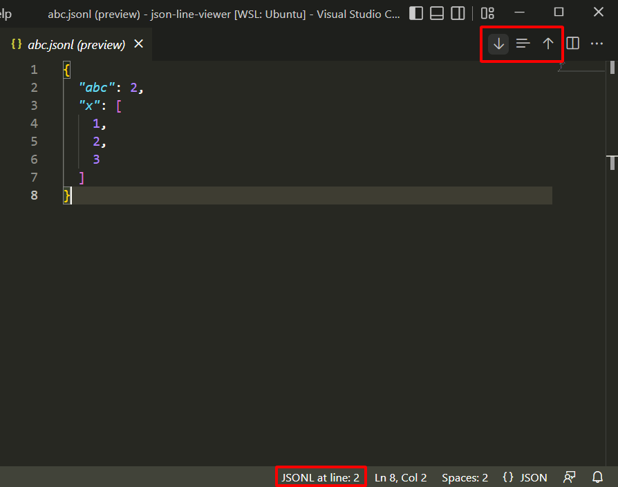

# JSON Lines Viewer

This extension provides previews for JSON Lines (JSONL) files.
It show content of JSONL file's lines in JSON format.

## Features
To open the preview, do one of the following:
- Right-click a Jsonl file, choose `Open JSON Lines Preview`
- Open a Jsonl file, click the `Open JSON Lines Preview` icon in the editor title bar
- Open a Jsonl file, run command `Open JSON Lines Preview`

Move to different lines:
- Click the `JSONL Next Line`, `JSONL Previous Line` or `JSONL Go to Line` icon in the editor title bar, or run the corresponding command.

<!-- ## Requirements -->

<!-- ## Extension Settings -->

<!-- This extension contributes the following settings:

* `myExtension.enable`: enable/disable this extension
* `myExtension.thing`: set to `blah` to do something -->

<!-- ## Known Issues -->

## Release Notes

### 0.0.1
Initial release

### 0.0.2
Update Readme and instructions

### 0.0.3
Fix path error in Windows

### 0.0.4
Fix path error in Linux